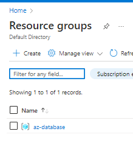
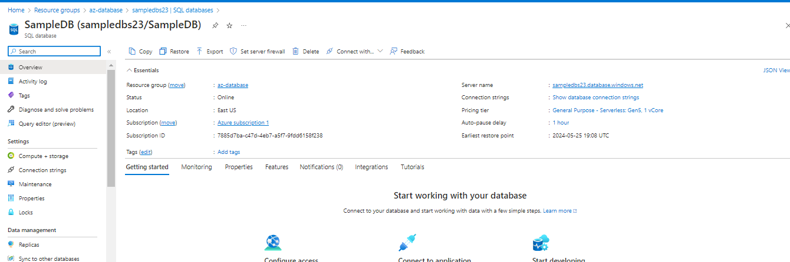
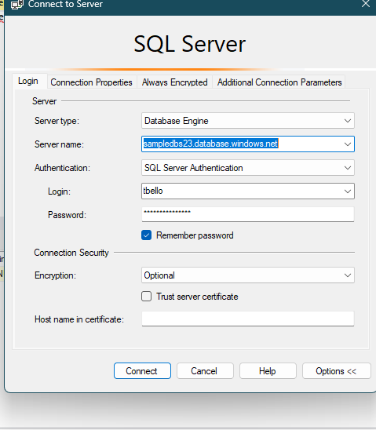
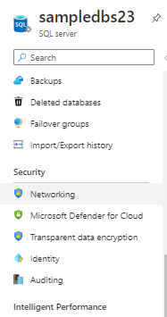
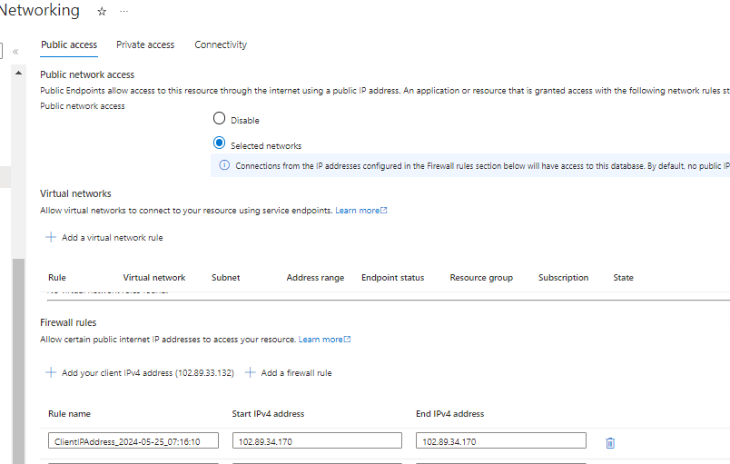
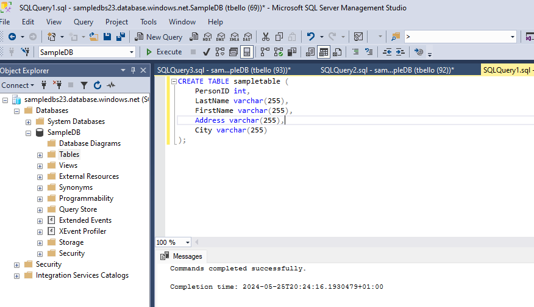
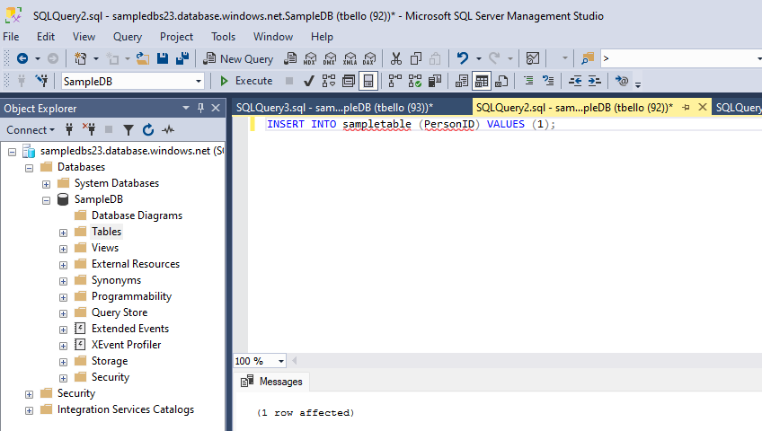
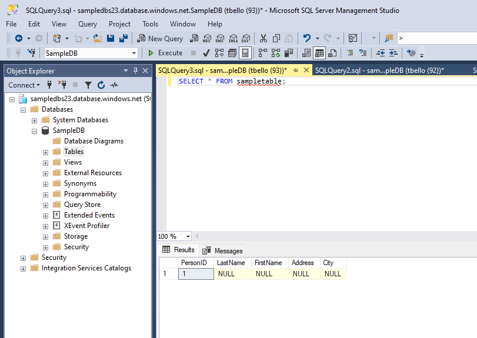

# Azure SQL SERVER
According to wikipedia, Microsoft SQL server is a proprietary relational database management system developed by Microsoft. In other terms it is a paid SQL server but Microsoft provides the SQL SERVER Developer edition licensed for use as a development and test database in a non production environment.
 
In this article we would be create a SQL SERVER on Azure. Azure provides the  Azure SQL SERVER Service to achieve this. The walkthrough includes the following steps:
- STEP 1: Create a resource group
- STEP 2: Create an Azure SQL Server
- STEP 3: Create a sample Database
- STEP 4: Download and Install Microsoft SQL Server Management Studio 
- STEP 5: WRITE CREATE, INSERT and SELECT Queries
## STEP 1:  Create a Resource Group

Resource group in azure portal allows cloud engineer group resources based on different reasons together. It is good practice to create a resource group before creating any service. Alright so create a resource group named `az-database`. Below is a screenshot of the resource group I created

## STEP 2: Create an Azure SQL SERVER

Now that we have our resource group, navaigate into the `az-database` resource group and create the Azure SQL server. When creating I picked the SQL authentication. Created an azure sql server named `sampledbs23`

## STEP 3: Create a sample database
Next I create a sample database with the name `sampledb`

## STEP 4: Download and Install Microsoft SQL Server Management Studio

Alright to be honest I just learnt the differnce between MySQL and SQL Server while figuring out this task. I already have MySQL workbench installed and I expected I could connect to the Azure SQL Server but it turns out MySQL and SQL Server are totally different types of Database. 
Downloaded from https://aka.ms/ssmsfullsetup
After Installation I tried connecting using the SQL authentication I created when creating the sample DB

I ran into the issue of the Azure SQL server not allowing inbound network. Fixed it by taking the steps listed below
- In the azure sql server portal click on networking in the security tab
    
- Click on public tab in the network portal 
    
- Add firewall rule to allow incoming request from IP Address

## STEP 5: WRITE CREATE, INSERT and SELECT Queries
- Created a sample table
    

- Insert data into sample table 
    

- View data in sample table 
    